# Mapa de relacionamento dos metadados

> **Gerado** por `ci/generate_graph.py` a partir dos metadados reais. Não editar à mão —
> regenerar com `python ci/generate_graph.py`. É um artefato derivado, não fonte de verdade.

Legenda: azul-escuro = projeto · azul = capacidade (`CAP-`) · ciano = componente (`CMP-`) ·
roxo = interface (`IFC-`) · verde = regra (`RULE-`) · rosa = superfície de UI (`UI-`) ·
amarelo = ADR · vermelho = risco (`RISK-`).

```mermaid
graph TD
  PROJ_danzeroum_project["danzeroum-project"]
  TEST_tests_unit_test_ports_py{{"test_ports.py"}}
  TEST_tests_unit_test_pricing_py{{"test_pricing.py"}}
  CAP_CATALOG["CAP-CATALOG<br/>Catálogo de produtos"]
  PROJ_danzeroum_project -->|capacidade| CAP_CATALOG
  CAP_PRICING["CAP-PRICING<br/>Precificação"]
  PROJ_danzeroum_project -->|capacidade| CAP_PRICING
  CMP_CATALOG["CMP-CATALOG<br/>ports.py"]
  CMP_CATALOG -->|realiza| CAP_CATALOG
  CMP_CATALOG -.->|testa| TEST_tests_unit_test_ports_py
  CMP_PRICING["CMP-PRICING<br/>pricing.py"]
  CMP_PRICING -->|realiza| CAP_PRICING
  CMP_PRICING -->|depende| CMP_CATALOG
  CMP_PRICING -.->|implementa| REQ_001
  CMP_PRICING -.->|testa| TEST_tests_unit_test_pricing_py
  IFC_CATALOG_PORT(["IFC-CATALOG-PORT<br/>Porta de catálogo de produtos"])
  CMP_CATALOG -.->|provê| IFC_CATALOG_PORT
  IFC_CATALOG_PORT -.->|consome| CMP_PRICING
  IFC_PRICING_API(["IFC-PRICING-API<br/>API de precificação"])
  CMP_PRICING -.->|provê| IFC_PRICING_API
  RULE_CATALOG_001["RULE-CATALOG-001"]
  CAP_CATALOG -->|regra| RULE_CATALOG_001
  RULE_CATALOG_001 -.->|verifica| TEST_tests_unit_test_ports_py
  RULE_PRICING_001["RULE-PRICING-001"]
  CAP_PRICING -->|regra| RULE_PRICING_001
  RULE_PRICING_001 -.->|verifica| TEST_tests_unit_test_pricing_py
  RULE_PRICING_002["RULE-PRICING-002"]
  CAP_PRICING -->|regra| RULE_PRICING_002
  RULE_PRICING_002 -.->|verifica| TEST_tests_unit_test_pricing_py
  RULE_PRICING_003["RULE-PRICING-003"]
  CAP_PRICING -->|regra| RULE_PRICING_003
  RULE_PRICING_003 -.->|verifica| TEST_tests_unit_test_pricing_py
  UI_CATALOG_LIST["UI-CATALOG-LIST"]
  UI_CATALOG_LIST -->|experiência| CAP_CATALOG
  UI_CATALOG_LIST -.->|satisfaz| REQ_003
  UI_PRICING_PAGE["UI-PRICING-PAGE"]
  UI_PRICING_PAGE -->|experiência| CAP_PRICING
  UI_PRICING_PAGE -.->|satisfaz| REQ_001
  MET_ACTIVATION[["MET-ACTIVATION"]]
  MET_AOV[["MET-AOV"]]
  MET_DISCOVERY[["MET-DISCOVERY"]]
  REQ_001["REQ-001<br/>done"]
  REQ_001 -->|requisito| CAP_PRICING
  REQ_001 ==>|move| MET_ACTIVATION
  REQ_001 -.->|regido por| RULE_PRICING_001
  REQ_001 -.->|regido por| RULE_PRICING_003
  REQ_001 -.->|validado por| TEST_tests_unit_test_pricing_py
  REQ_002["REQ-002<br/>proposed"]
  REQ_002 -->|requisito| CAP_PRICING
  REQ_002 ==>|move| MET_AOV
  REQ_002 -.->|regido por| RULE_PRICING_001
  REQ_003["REQ-003<br/>planned"]
  REQ_003 -->|requisito| CAP_CATALOG
  REQ_003 ==>|move| MET_DISCOVERY
  REQ_003 -.->|regido por| RULE_CATALOG_001
  REQ_004["REQ-004<br/>proposed"]
  REQ_004 -->|requisito| CAP_CATALOG
  REQ_004 -.->|depende| REQ_003
  REQ_004 ==>|move| MET_DISCOVERY
  REQ_004 -.->|regido por| RULE_CATALOG_001
  RISK_CHANGE_001["RISK-CHANGE-001"]
  RISK_CONF_001["RISK-CONF-001"]
  RISK_DEP_001["RISK-DEP-001"]
  RISK_META_001["RISK-META-001"]
  RISK_META_002["RISK-META-002"]
  RISK_PRIV_001["RISK-PRIV-001"]
  RISK_PRIV_002["RISK-PRIV-002"]
  RISK_STAGE_001["RISK-STAGE-001"]
  RISK_WEBQA_001["RISK-WEBQA-001"]
  ADR_001["ADR-001"]
  ADR_001 -->|mitiga| RISK_WEBQA_001
  ADR_002["ADR-002"]
  ADR_002 -->|mitiga| RISK_META_001
  ADR_003["ADR-003"]
  ADR_003 -->|decide| CAP_PRICING
  ADR_003 -->|mitiga| RISK_DEP_001
  ADR_004["ADR-004"]
  ADR_004 -->|mitiga| RISK_CHANGE_001
  ADR_005["ADR-005"]
  ADR_005 -->|decide| CAP_CATALOG
  ADR_005 -->|decide| CMP_CATALOG
  ADR_005 -->|decide| CMP_PRICING
  ADR_006["ADR-006"]
  ADR_006 -->|mitiga| RISK_CONF_001
  ADR_006 -->|mitiga| RISK_STAGE_001
  ADR_007["ADR-007"]
  ADR_007 -->|mitiga| RISK_PRIV_001
  ADR_007 -->|mitiga| RISK_PRIV_002
  classDef project fill:#1f2937,stroke:#111827,color:#fff;
  class PROJ_danzeroum_project project;
  classDef cap fill:#2563eb,stroke:#1e40af,color:#fff;
  class CAP_CATALOG,CAP_PRICING cap;
  classDef cmp fill:#0891b2,stroke:#0e7490,color:#fff;
  class CMP_CATALOG,CMP_PRICING cmp;
  classDef ifc fill:#7c3aed,stroke:#5b21b6,color:#fff;
  class IFC_CATALOG_PORT,IFC_PRICING_API ifc;
  classDef rule fill:#16a34a,stroke:#15803d,color:#fff;
  class RULE_CATALOG_001,RULE_PRICING_001,RULE_PRICING_002,RULE_PRICING_003 rule;
  classDef ui fill:#db2777,stroke:#9d174d,color:#fff;
  class UI_CATALOG_LIST,UI_PRICING_PAGE ui;
  classDef req fill:#0d9488,stroke:#0f766e,color:#fff;
  class REQ_001,REQ_002,REQ_003,REQ_004 req;
  classDef met fill:#ea580c,stroke:#c2410c,color:#fff;
  class MET_ACTIVATION,MET_AOV,MET_DISCOVERY met;
  classDef test fill:#57534e,stroke:#44403c,color:#fff;
  class TEST_tests_unit_test_ports_py,TEST_tests_unit_test_pricing_py test;
  classDef adr fill:#ca8a04,stroke:#a16207,color:#fff;
  class ADR_001,ADR_002,ADR_003,ADR_004,ADR_005,ADR_006,ADR_007 adr;
  classDef risk fill:#dc2626,stroke:#991b1b,color:#fff;
  class RISK_CHANGE_001,RISK_CONF_001,RISK_DEP_001,RISK_META_001,RISK_META_002,RISK_PRIV_001,RISK_PRIV_002,RISK_STAGE_001,RISK_WEBQA_001 risk;
```

